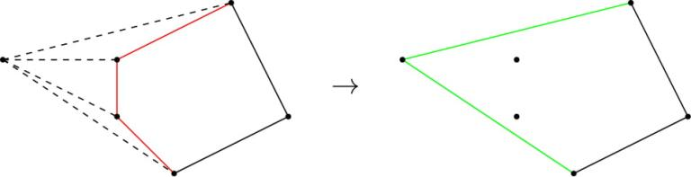
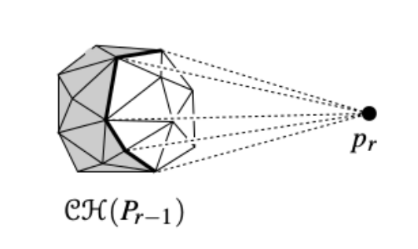
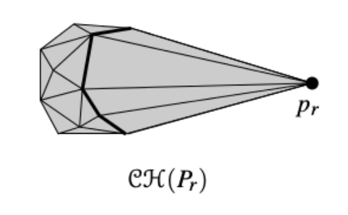

# Convex Hull - 3D Implementation

## Definitions

- `Convex Polygon`: A polygon with all its interior angles less than 180 degrees
- `Convex Hull`: The smallest convex polygon enclosing a given set of points

## Assumptions
* Not all points are co-planar

## Algorithm

This algorithm is an extension of the incremental algorithm used for defining the convex hull of a set of points in the two-dimensional plane.
In the 2-D case, we assume that we have already determined the convex hull of the first i-1 points. Now, when we reach the ith point, we form a new convex polygon by following these steps:
1. Mark the edges that are visible from the ith point
2. Remove those edges
3. Connect new edges to the new point from the remaining points to form a new convex hull

Note- We are considering the face of the polyhedron as a triangle because any polygon can be broken down into several triangles.

The 3-D case is just an extension of the 2-D algorithm. We assume we have a convex polyhedron for the first i-1 points. Now when we counter the ith point, we remove the faces visible to the point rather than the edges. We perform the following steps:
1. Mark the faces visible from the ith point
2. Remove those faces from the convex hull
3. Add new faces from the ith point to the edges lying on the horizon

We have to understand some things in greater detail.

### Visibility of a face from a point

In order to check if a face is visible from a point or not, we create a vector from any point on the face(for simplicity we consider a vertex of the face) to our point. We then take the dot product of this vector with the outward pointing normal to the face. If the dot product is positive, it means the normal vector is directed towards the point and the face is visible. On the contrary, if the dot product is negative, it means the normal is pointing away from the point and the face is not visible.

### Edges on the Horizon

We talk about creating faces from each edge in the horizon to the point being considered.

The horizon is the boundary formed by the edges of the faces invisible to the point being considered. Since we only remove the visible faces from the convex hull, the invisible faces remain intact.

After removing the visible faces, new faces are added between each edge from the horizon and the point to ensure that all points lie inside the newly created convex hull.

### How do we get to know the edges that are a part of the horizon?

The edges of the visible faces would have been marked true. When we iterate through the invisible faces, if some edge has been marked true in the opposite direction, it implies that it is a part of some visible face. This implies, that edge has an adjacent visible as well as invisible face and hence lies on the horizon.

We store the faces which are part of the convex hull in a vector and at last, isolate the vertices from the faces and remove the duplicates in the process.

# Time Complexity 

n = number of vertices

The time complexity of the algorithm is O(n^2). This is because, in the outer for loop, we iterate n times making it an O(n) operation. Within the for loop we iterate over all the faces. If we can prove that the number of faces is of the order O(n), then we are done.

We can use Euler's formula for a 3-D polyhedron to prove this. According to the Euler's formula:
V-E+F=2 where,
V = number of vertices
E = number of edges
F = number of faces

Since we have divided the polyhedron into triangles, we have E = 3F/2 since each face has 3 edges, and each edge gets counted twice. Plugging the relation into the formula we get,
V - F/2 = 2 => F = 2V-4
Hence, we have proved that the number of faces is O(n) and the time complexity is O(n^2)

# Space Complexity 

The space complexity is O(n^2) because the largest data structure used is a 2-d vector of size n^2 which stores whether the edge between two vertices is a part of a horizon

# References

* https://cw.fel.cvut.cz/wiki/_media/misc/projects/oppa_oi_english/courses/ae4m39vg/lectures/05-convexhull-3d.pdf
* http://people.csail.mit.edu/indyk/6.838-old/handouts/lec10.pdf
* https://en.wikipedia.org/wiki/Convex_hull
* https://tildesites.bowdoin.edu/~ltoma/teaching/cs3250-CompGeom/spring17/Lectures/cg-hull3d.pdf
